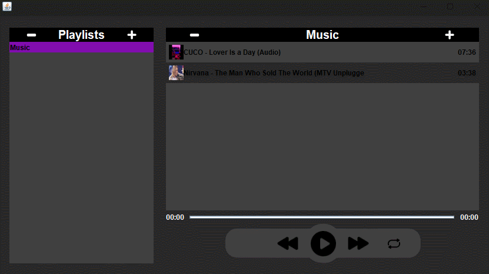
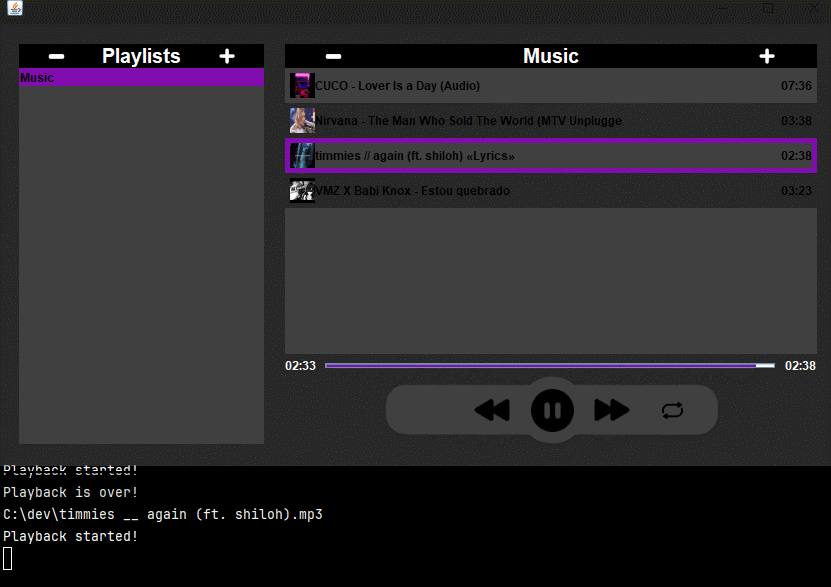

## 🎵 About

**Harmonic Apolo** is a music player in Java that aims to manage music through playlist handling. Focusing on simplicity and efficiency, using third-party libraries for file handling and Swing for the GUI, Apolo offers the key features of a music player in an intuitive, practical, and harmonious way.

- Create, delete and switch between playlists.
  

- Add (button or drag and drop), delete and switch between playlists.
  

- When a song ends, it goes to the next one in the playlist, unless repeat is active or it is at the end of the queue. In addition, it has all the main features of a playback-control.
  

## 🔨 Tools

- [Java](https://docs.oracle.com/en/java/)
- [Maven](https://maven.apache.org)
- [JLayer](https://github.com/umjammer/jlayer)
- [JAudioTagger](https://www.jthink.net/jaudiotagger/)

## 📄 Dependencies

- [`Java JDK`](https://www.oracle.com/java/technologies/downloads/) (mandatory)
- [`Make`](https://gnuwin32.sourceforge.net/packages/make.htm) (optional)

## 💿 How Contribute

```bash
#Clone the project
$ git clone https://github.com/Ytalk/music-player.git
```

```bash
#Enter directory
$ cd music-player
```

```bash
#Run with makefile

#Linux/macOS:
$ make lpermission
$ make compile
$ make run

#Windows:
$ make compile
$ make run
```

<p align = "center">or</p>

```bash
#Run without makefile

#Linux/macOS:
$ chmod +x mvnw
$ ./mvnw compile
$ ./mvnw exec:java

#Windows:
$ ./mvnw compile
$ ./mvnw exec:java
```