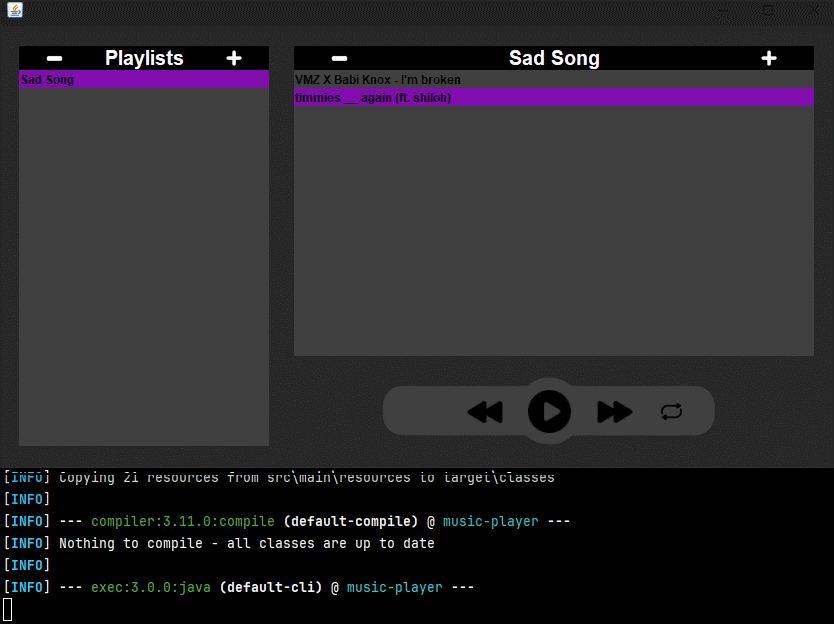
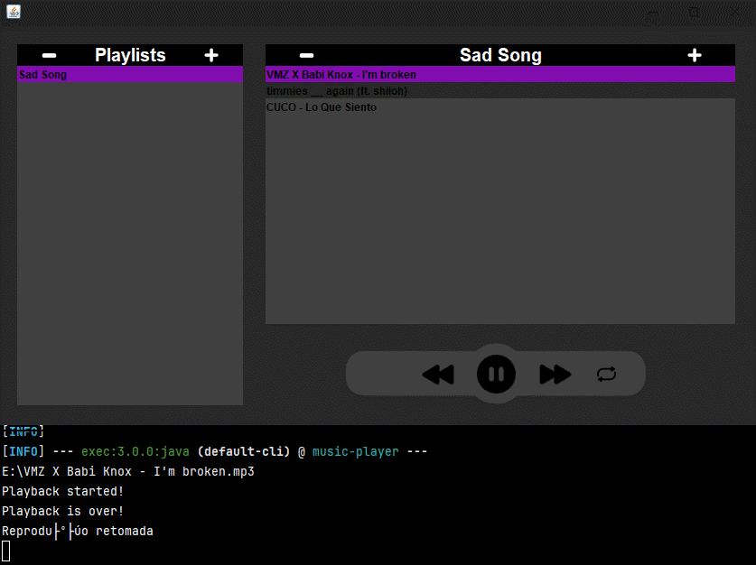

## 🎵 About

**Apolo** is a music player that aims to manage or download music. Allows you to show notes (like a tuner) and record audio.

- Create, delete and switch between playlists.
  

- Add music, play, pause and resume.
  

- When a song ends, it goes to the next one in the playlist, unless repeat is active or it is at the end of the queue.
  

## 🔨 Tools

- [Java](https://docs.oracle.com/en/java/)
- [Maven](https://maven.apache.org)
- [JLayer](https://github.com/umjammer/jlayer)
- [JAudioTagger](https://www.jthink.net/jaudiotagger/)

## 📄 Dependencies

- [`Java JDK`](https://www.oracle.com/java/technologies/downloads/) (mandatory)
- [`Make`](https://gnuwin32.sourceforge.net/packages/make.htm) (optional)

## 💿 How Contribute

```bash
#Clone the project
$ git clone https://github.com/Ytalk/music-player.git
```

```bash
#Enter directory
$ cd music-player
```

```bash
#Run with makefile

#Linux/macOS:
$ make lpermission
$ make run

#Windows:
$ make run
```

<p align = "center">or</p>

```bash
#Run without makefile

#Linux/macOS:
$ chmod +x mvnw
$ ./mvnw exec:java

#Windows:
$ ./mvnw exec:java
```